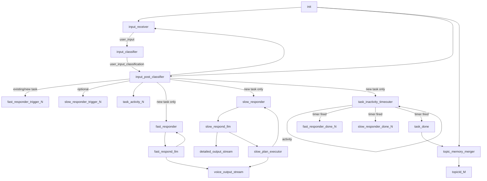

# Voice Agent Architecture (Current)

This document describes the current architecture after the SAF `0.1.5` rewrite.

## 1) High-level Diagram

```mermaid
flowchart LR
  subgraph client [Browser Client]
    mic[Microphone Capture]
    wsClient[WebSocket Client]
    activity[Activity Panel]
    canvas[Detailed Canvas]
    player[TTS Audio Playback]
  end

  subgraph backend [FastAPI Backend]
    wsApi[/ws endpoint]
    stt[OpenAI Realtime STT]
    tts[OpenAI Realtime TTS]
    graph[SAF AdvancedStateGraph]
  end

  mic --> wsClient --> wsApi
  wsApi --> stt
  stt -->|stt_chunk/stt_output| wsApi
  stt -->|final transcript -> user_input channel| graph

  graph -->|voice_output_stream| wsApi
  graph -->|detailed_output_stream| wsApi
  wsApi --> wsClient

  wsApi --> tts
  tts -->|ai_audio/ai_audio_end| wsApi --> wsClient

  wsClient --> activity
  wsClient --> canvas
  wsClient --> player
```

## 2) Backend Graph (SAF 0.1.5)



## 3) State Model

State is a dynamic map (`map<string, any>`).  
Two fixed counters:

- `TaskIdCounter`
- `TopicIdCounter`

Per task `N`:

- `taskN_name`
- `taskN_description`
- `taskN_user_inputs` (list)
- `taskN_user_quick_outputs` (list)
- `taskN_user_slow_outputs` (list)
- `taskN_topic_id`

Per topic `M`:

- `topicId_M` (topic summary text)

When a task is closed and merged into topic memory, `taskN_*` keys are tombstoned to `null` to prevent unbounded growth.

## 4) Streams and Channels

### Custom output streams

- `voice_output_stream`: short/final user-facing answer
- `detailed_output_stream`: planner/progress details

### Async channels

- `user_input`
- `user_input_classification`
- `task_done`
- Prefix channels:
  - `fast_responder_done_`
  - `slow_responder_done_`
  - `fast_responder_trigger_`
  - `slow_responder_trigger_`
  - `task_activity_`

## 5) Frontend Behavior

- `voice_output_stream`:
  - immediately stops current playback
  - updates Activity panel
  - triggers TTS playback of latest answer
- `detailed_output_stream`:
  - appended to central `DetailedCanvas`
- Speech interruption:
  - mic capture computes RMS voice activity
  - if speaking persists beyond threshold (default 1s), current TTS playback is stopped
  - playback resumes with subsequent AI audio when speaking ends

